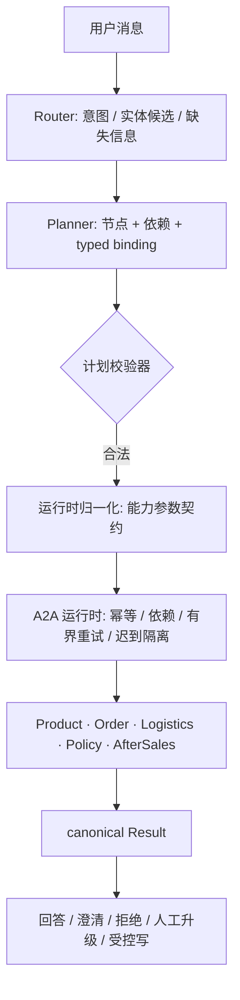

# 电商客服 Multi-Agent：意图路由 · Agent 协作 · 安全写 · 执行型评测

一个面向**商品 / 订单 / 物流 / 政策 / 售后**五类请求的客服 Multi-Agent 系统。用户用自然语言提问，LLM Router/Planner 把它转成结构化计划，Supervisor 按计划把任务派发给领域 Agent（版本化 Agent 间消息协议），真实调用工具完成任务；售后这类高风险动作走"预览 → 用户确认 → 服务端复核 → 单事务提交"。

## 核心结果

dev 集 123 个唯一 case，单次运行；真实模型与基线在同一套数据上测量。

| 指标 | 本系统 | 关键词基线 |
|---|---:|---:|
| 意图 Core Macro-F1（11 类） | **0.853** | 0.463 |
| exact handoff | **0.764** | 0.350 |
| 真实任务完成率 | **0.769** | 0.479 |
| 不必要澄清率（越低越好） | **0.057** | 0.390 |

口径、分母、失败分析与限制见 [`docs/results.md`](docs/results.md)；完整逐例证据见 [`docs/evidence/`](docs/evidence/)。`MULTI_INTENT` 是辅助标签（dev 中 gold support 为 0），Core 11 类与 12 类兼容值（0.782）同时给出，避免混用。

## 架构



几条关键设计：

- **单一权威计划**：能力集合与依赖从节点/边派生，不要求模型重复填写拓扑或能力汇总。
- **模型与规则分工**：结构化编号（订单号、运单号、SKU、手机号、售后类型、承运商）由确定性规则给候选，语义角色由模型判断；会话手机号与上游派生字段由运行时按契约补齐，不向用户追问。
- **受控写**：动作化确认令牌（申请/取消/修改分离）+ 状态 CAS + 幂等指纹 + 审计与 outbox，同一事务提交；单轮停在"等待确认"。
- **执行型评测**：模型生成的计划经同一个运行时真实执行，检查终态与业务结果；无效计划不执行、不计成功。

详见 [`docs/architecture.md`](docs/architecture.md)。

## 快速开始

```bash
pip install -r requirements-dev.txt

# 无 Key：生成隔离合成夹具并跑确定性的基线/上界
python scripts/r5_seed_synthetic_data.py --output-dir .tmp/r5-synthetic
python -m eval.r5_router_planner_eval --split dev --candidate keyword_router --data-dir .tmp/r5-synthetic
python -m eval.r5_router_planner_eval --split dev --candidate oracle        --data-dir .tmp/r5-synthetic
python -m pytest -q
```

真实模型运行需要 `.env` 中的 `OPENAI_API_KEY` / `OPENAI_BASE_URL` / `OPENAI_MODEL`：

```bash
python -m eval.r5_router_planner_eval --split dev --candidate real
```

完整命令见 [`docs/quickstart.md`](docs/quickstart.md)。

## 仓库结构

- `agent/`：Router/Planner、计划契约与参数绑定、A2A 运行时、五领域 repository/工具、安全写与确认令牌、Trace/存储。
- `eval/`：统一评测入口 `r5_router_planner_eval.py`、真实执行链 `r5_plan_executor.py`、真实模型 provider、数据集与 harness。
- `scripts/`：合成夹具、数据集构建、敏感扫描。
- `tests/`：当前主线的单元与集成测试。
- `docs/`：架构、运行说明、结果与冻结证据。

## 边界

- 数据为**项目自建合成样本**，非外部客户流量；来源分层（订单本地只读投影、物流订单派生快照、商品/售后自建、政策确定性夹具）。
- 写操作评测停在"等待用户确认"；"确认后提交完成"未测量。
- 未实现 replan，不主张动态规划增益。
- 任务完成率不评估最终回答文案质量。
- 不声明生产可用性或外部泛化。
