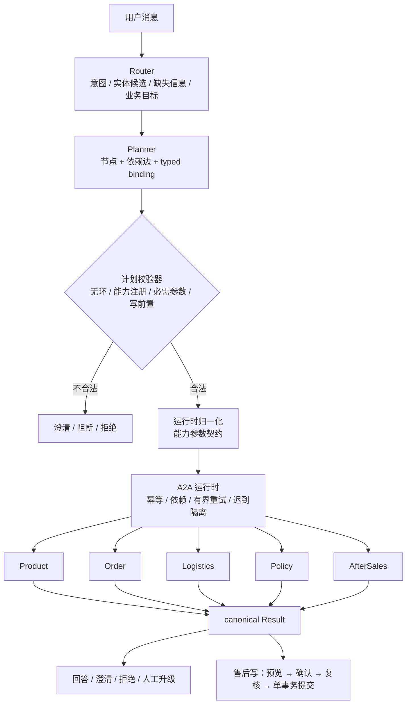

# 架构

一个面向**商品 / 订单 / 物流 / 政策 / 售后**五类请求的客服 Multi-Agent 系统。用户用自然语言提问，系统理解意图、生成结构化计划、把任务派发给对应领域 Agent、真实调用工具，最后给出结果；售后这类高风险动作走"预览 → 用户确认 → 服务端复核 → 单事务提交"。

## 总览

## 组成

**Router**：把用户消息解析成意图集合、实体候选、缺失信息与业务目标。只提出候选，不调用工具、不改计划。

**Planner**：生成**单一权威计划**——节点（能力 + 参数/绑定）、依赖边、失败策略。能力集合与依赖关系从节点/边派生，不要求模型重复填写拓扑名称或能力汇总。

**计划校验器**：无环、节点唯一、能力已注册、必需参数可解析、写操作必须有资格前置、澄清计划不得包含写/升级节点。

**运行时归一化**：按"能力参数契约"确定性地补齐参数，来源分四类——用户实体（订单号/运单号/SKU/手机号/售后类型/承运商）、可信会话上下文（登录用户的手机号）、上游结果派生（先读订单再取承运商与运单号）、原始请求文本（政策查询）。**模型只负责选能力和判断语义角色**（例如一句话里两个订单号选哪个），不负责会话与派生字段。

**A2A 运行时**：领域间传递版本化消息，提供幂等去重、依赖等待与释放、有界重试、迟到消息隔离、可审计 ledger 与 trace。

**五领域**：
| 领域 | 能力 | 说明 |
|---|---|---|
| Product | `product/read` | 版本化商品目录，未知 SKU 返回目录错误，缺价/缺库存不猜测 |
| Order | `order/read` | 本地只读订单投影，按用户与手机号归属校验 |
| Logistics | `logistics/read` | 版本化物流快照，可按运单号或订单派生查询 |
| Policy | `policy/read` | 政策/知识检索，返回证据与版本 |
| AfterSales | `aftersales/read`、`aftersales/eligibility`、`aftersales/write` | 查询、确定性资格判定、受控写入 |

**安全写**：动作化确认令牌（申请/取消/修改分离，申请令牌不能授权取消或修改），令牌绑定订单、服务、金额、payload 与身份；状态 CAS + 幂等指纹 + 审计 + outbox 在同一事务提交。单轮请求停在"等待用户确认"，不自动提交。

**人工升级**：投诉或明确要求人工时走 `human/handoff` 升级路径，不自行承诺赔付。

## 评测

- **单一评测入口**：`eval/r5_router_planner_eval.py`，支持 `--split`、`--candidate`、`--data-dir`。
- **真实执行链**：`eval/r5_plan_executor.py` 把模型生成的计划交给生产运行时执行，无效计划拒绝执行。
- **对照**：关键词路由基线 + oracle 上界 + 负控（空输出、永远澄清、错实体、漏目标、未请求写、越权能力）。
- **指标分离**：计划文本指标（覆盖 / 符合性）与**真实执行完成率**分开命名；无效计划不执行、不计成功。
- 结果与限制见 [`results.md`](results.md)。
