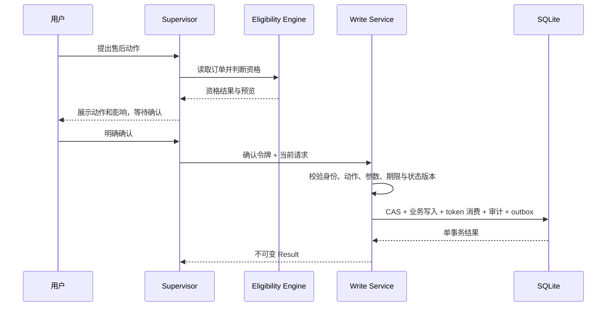

# 售后安全写

退款、退货、取消与修改等动作采用“预览 → 用户确认 → 服务端复核 → 单事务提交”的闭环。模型可以提出动作计划，但不能凭计划文本直接获得写权限。

## 执行流程

## 确认令牌

令牌绑定用户、会话、case、订单、服务类型、金额、payload、动作和到期时间。创建、取消、修改使用不同动作域，因此创建令牌不能授权取消或修改。令牌过期、撤销、已消费、身份不匹配或请求被篡改时，服务端拒绝执行。

## 提交边界

确认后仍会重新读取当前业务状态和版本，通过 CAS 防止预览之后的并发变化。token 消费、状态变更、不可变 Result、审计事件和 trace outbox 在同一事务内完成；任一步失败都会整体回滚。

## 评测边界

当前 Router/Planner dev 评测中的写请求以 `PENDING_CONFIRMATION` 为正确终态，用于证明系统不会绕过用户确认。确认之后的事务安全由 `tests/r5/test_safe_write_matrix.py` 覆盖，主任务完成率不把待确认动作表述为已经提交。
